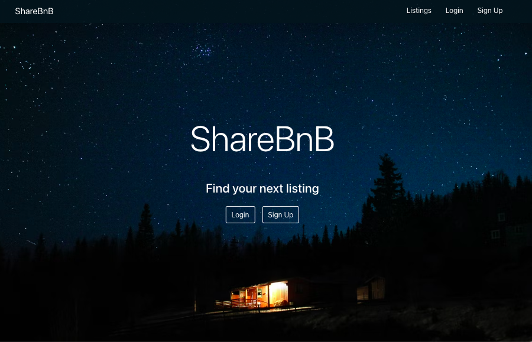

# ShareBnB
A single page React frontend and a RESTful API backend to register user accounts, create and edit listings with image upload functionality. Images are saved to Amazon S3 bucket while rest of the data is saved to a PostgreSQL database.

### Technologies
- React
- Flask
- SQLAlchemy
- PostgreSQL
- AWS S3

_Pair programmed with [Joannes Figueroa](https://github.com/JoHeyJo)_

### Routes
- /
- /login
- /signup
- /listings
- /listings/:id
- /listing/user
- /user

### Functionalities to be implemented:
- Allow users to message each other
- Map of listings
- Save booked and past listings
- Save favorite listings
- Allow users to write reviews